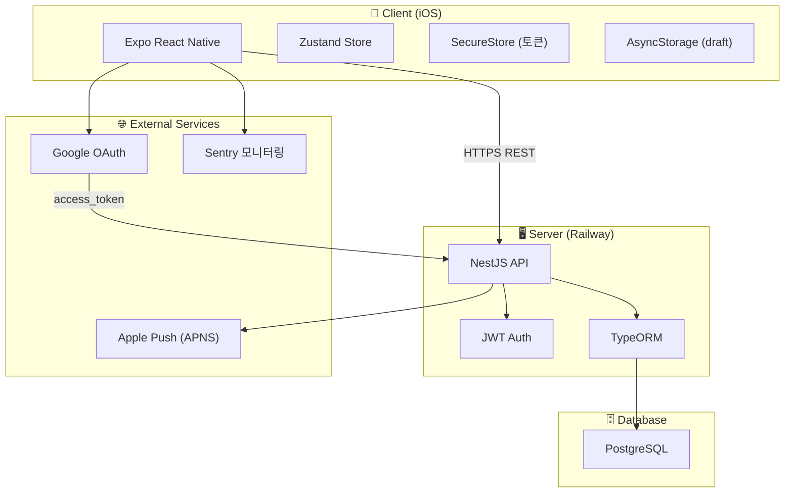
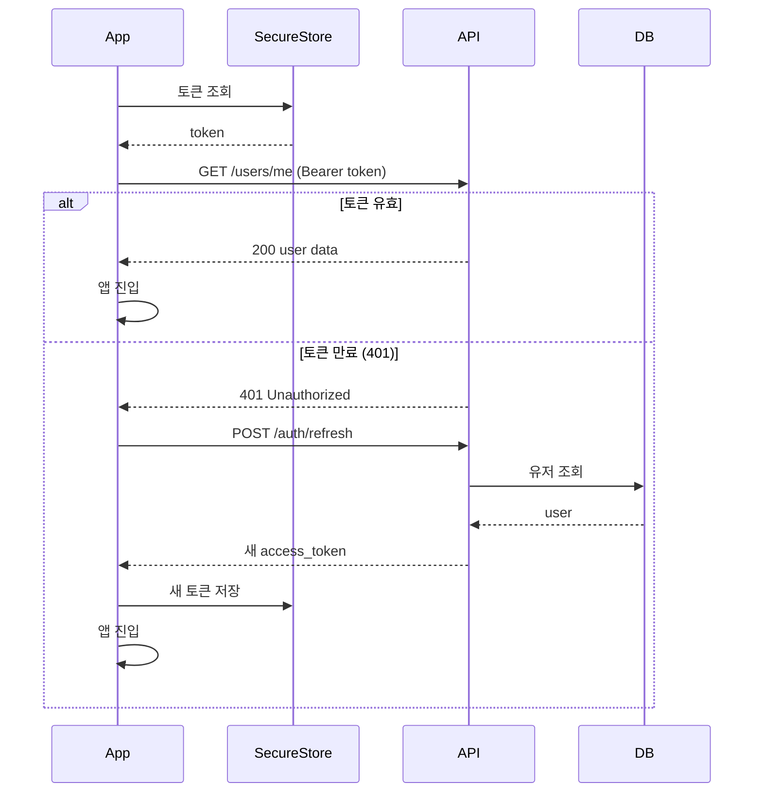
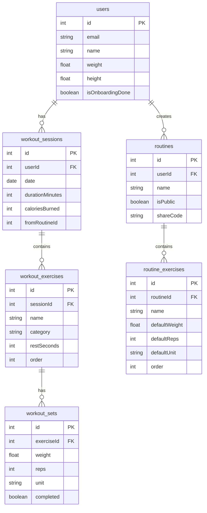
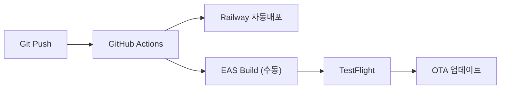

# Harulog 아키텍처 다이어그램

## 시스템 아키텍처

```mermaid
graph TB
    subgraph Client["📱 Client (iOS)"]
        App["Expo React Native"]
        Zustand["Zustand Store"]
        SecureStore["SecureStore (토큰)"]
        AsyncStorage["AsyncStorage (draft)"]
    end

    subgraph Server["🖥 Server (Railway)"]
        NestJS["NestJS API"]
        JWT["JWT Auth"]
        TypeORM["TypeORM"]
    end

    subgraph DB["🗄 Database"]
        PG["PostgreSQL"]
    end

    subgraph External["🌐 External Services"]
        Google["Google OAuth"]
        Sentry["Sentry 모니터링"]
        APNS["Apple Push (APNS)"]
    end

    App -->|HTTPS REST| NestJS
    NestJS --> JWT
    NestJS --> TypeORM
    TypeORM --> PG
    App --> Google
    Google -->|access_token| NestJS
    App --> Sentry
    NestJS --> APNS
```

## 인증 플로우

```mermaid
sequenceDiagram
    participant App
    participant SecureStore
    participant API
    participant DB

    App->>SecureStore: 토큰 조회
    SecureStore-->>App: token
    App->>API: GET /users/me (Bearer token)
    
    alt 토큰 유효
        API-->>App: 200 user data
        App->>App: 앱 진입
    else 토큰 만료 (401)
        API-->>App: 401 Unauthorized
        App->>API: POST /auth/refresh
        API->>DB: 유저 조회
        DB-->>API: user
        API-->>App: 새 access_token
        App->>SecureStore: 새 토큰 저장
        App->>App: 앱 진입
    end
```

## ERD

```mermaid
erDiagram
    users ||--o{ workout_sessions : "has"
    users ||--o{ routines : "creates"
    workout_sessions ||--o{ workout_exercises : "contains"
    workout_exercises ||--o{ workout_sets : "has"
    routines ||--o{ routine_exercises : "contains"

    users {
        int id PK
        string email
        string name
        float weight
        float height
        boolean isOnboardingDone
    }

    workout_sessions {
        int id PK
        int userId FK
        date date
        int durationMinutes
        int caloriesBurned
        int fromRoutineId
    }

    workout_exercises {
        int id PK
        int sessionId FK
        string name
        string category
        int restSeconds
        int order
    }

    workout_sets {
        int id PK
        int exerciseId FK
        float weight
        int reps
        string unit
        boolean completed
    }

    routines {
        int id PK
        int userId FK
        string name
        boolean isPublic
        string shareCode
    }

    routine_exercises {
        int id PK
        int routineId FK
        string name
        float defaultWeight
        int defaultReps
        string defaultUnit
        int order
    }
```

## CI/CD 파이프라인

```mermaid
graph LR
    Push["Git Push"] --> GHA["GitHub Actions"]
    GHA --> Backend["Railway 자동배포"]
    GHA --> EAS["EAS Build (수동)"]
    EAS --> TF["TestFlight"]
    TF --> OTA["OTA 업데이트"]
```
